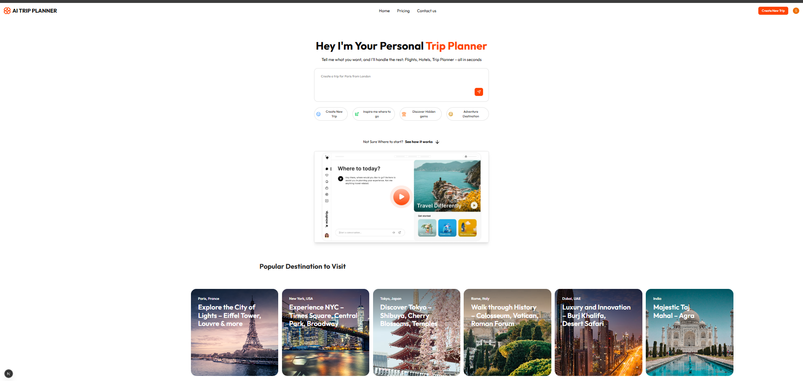

🌍 AI Trip Planner App ✈️

An AI-powered Full Stack Travel Planner built with Next.js, React, TypeScript, Convex, Clerk, Mapbox, Arcjet, and Google Places API.
Easily plan trips with AI, explore interactive maps, manage your trips, and save itineraries securely.

## Preview

Here’s a screenshot of the homepage:

🔗 Live Demo: https://www.planaitrip.site

🚀 Features

✅ AI-powered trip planning (personalized itineraries)
✅ Secure authentication with Clerk
✅ Real-time interactive maps with Mapbox
✅ Location data via Google Places API
✅ Convex as backend database (serverless & real-time)
✅ Arcjet for security & rate limiting
✅ Save, view, and manage your trips
✅ Responsive & modern UI with Next.js + TailwindCSS

🛠️ Tech Stack

Frontend: Next.js, React, TypeScript, TailwindCSS

Backend: Convex (serverless DB)

Auth: Clerk

AI Integration: OpenAI (via Convex mutations)

Maps & Data: Mapbox, Google Places API

Security: Arcjet (Rate limiting & abuse prevention)

Deployment: Vercel
